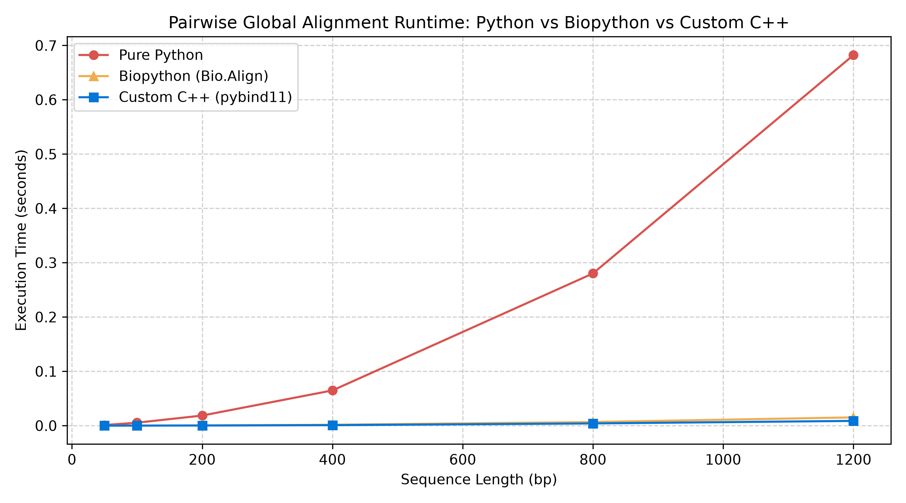

# Pairwise Genomic Sequence Alignment Engine (C++ / Python)

A high-performance algorithmic engine implementing dynamic programming algorithms for pairwise biological sequence alignment (DNA/RNA/Protein): **Needleman-Wunsch** (Global Alignment), **Smith-Waterman** (Local Alignment), **Gotoh** (Affine Gap Penalties), and **Hirschberg** (Linear-Space Global Alignment).

Features a modular dual-backend architecture: an optimized **C++ extension via `pybind11`** utilizing contiguous 1D row-major indexing for cache efficiency, alongside an interpretable pure-Python reference implementation with automatic fallback.

---

## Algorithms Implemented

### 1. Needleman-Wunsch (Global Alignment)
- **Goal:** Optimal end-to-end alignment between sequences across full lengths.
- **Recurrence:** $M[i, j] = \max(M[i-1, j-1] + S(x_i, y_j), M[i-1, j] + d, M[i, j-1] + d)$
- **Complexity:** $\mathcal{O}(m \cdot n)$ time, $\mathcal{O}(m \cdot n)$ space.

### 2. Smith-Waterman (Local Alignment)
- **Goal:** Discovers highest-scoring local homologous motifs embedded within noisy sequences.
- **Recurrence:** $M[i, j] = \max(0, M[i-1, j-1] + S(x_i, y_j), M[i-1, j] + d, M[i, j-1] + d)$
- **Traceback:** Initiates at the global matrix maximum and terminates at cell score 0.

### 3. Gotoh Algorithm (Affine Gap Penalties)
- **Goal:** Biological realism where opening a gap costs more than extending it ($W = \text{open} + k \times \text{extend}$).
- **State Recurrence:** Employs a 3-state DP system tracking match ($M$), insertion ($I_x$), and deletion ($I_y$).
- **Complexity:** $\mathcal{O}(m \cdot n)$ time, $\mathcal{O}(m \cdot n)$ space.

### 4. Hirschberg's Algorithm (Linear-Space Alignment)
- **Goal:** Mitigates quadratic space exhaustion on chromosome-scale sequences.
- **Recurrence:** Combines forward and backward dynamic programming passes with divide-and-conquer recursion to compute optimal alignment tracebacks.
- **Complexity:** $\mathcal{O}(m \cdot n)$ time, $\mathcal{O}(\min(m, n))$ space.

---

## Features

- **Dual-Backend Architecture:** Toggle compiled C++ vs. pure Python backends via `use_cpp=True/False`.
- **Cache-Aligned Memory Optimization:** C++ core utilizes flattened 1D contiguous vectors (`std::vector<int>`) to maximize L1/L2 cache locality and bypass CPython boxing.
- **Competitive Throughput:** Consistently achieves up to a **93.9x speedup over pure Python** and executes **1.5x–1.9x faster than Biopython's C core**.
- **Full Traceback Reconstruction:** Outputs aligned query/reference sequence pairs formatted with gap tokens (`-`).
- **Comprehensive Verification:** Unit testing suite powered by `pytest` verifying algorithm parity, affine behavior, and memory equivalence.

---

## Performance Benchmark

Benchmarked across identical random DNA sequences comparing pure Python, Biopython (`Bio.Align.PairwiseAligner`), and custom C++ (`benchmark.py`):

| Sequence Length (bp) | Pure Python (s) | Biopython (s) | Custom C++ (s) | Speedup vs Py | Speedup vs Bio |
|:---------------------|:----------------|:--------------|:---------------|:--------------|:---------------|
| 50                   | 0.00109         | 0.00002       | 0.00002        | 65.0x         | 1.5x           |
| 100                  | 0.00542         | 0.00011       | 0.00006        | 93.9x         | 1.8x           |
| 200                  | 0.01856         | 0.00043       | 0.00022        | 84.8x         | 1.9x           |
| 400                  | 0.06480         | 0.00166       | 0.00085        | 76.2x         | 1.9x           |
| 800                  | 0.28018         | 0.00665       | 0.00407        | 68.8x         | 1.6x           |
| 1200                 | 0.68223         | 0.01518       | 0.00872        | 78.3x         | 1.7x           |



---

## Project Structure

```text
genomic-sequence-aligner/
├── src/
│   └── aligner_core.cpp      # C++ DP kernels (NW, SW, Gotoh, Hirschberg) via pybind11
├── aligner.py                # Python API exposing dynamic C++/Python backend selection
├── benchmark.py              # 3-way empirical runtime profiler & matplotlib plotting
├── test_aligner.py           # Pytest unit verification suite
├── setup.py                  # C++ extension compilation script
├── complexity_benchmark.png  # Generated runtime scaling comparison
├── requirements.txt          # Python dependencies
└── README.md
```

---

## Quickstart

### 1. Installation & Environment Setup

```bash
git clone https://github.com/jaideepgorijavolu-oss/genomic-sequence-aligner.git
cd genomic-sequence-aligner

python -m venv venv
# On Windows:
.\venv\Scripts\Activate.ps1
# On macOS/Linux:
source venv/bin/activate

pip install -r requirements.txt
```

### 2. Compile C++ Core Extension

```bash
python setup.py build_ext --inplace
```

---

## Usage

```python
from aligner import SequenceAligner

# Initialize aligner (defaults to C++ backend if compiled)
aligner = SequenceAligner(
    match_score=2, 
    mismatch_penalty=-1, 
    gap_penalty=-2, 
    gap_open=-3, 
    gap_extend=-1, 
    use_cpp=True
)

# 1. Global Alignment (Needleman-Wunsch)
a1, a2, score = aligner.needleman_wunsch("GATTACA", "GCATGCU")
print(f"Global Alignment (Score: {score}):\n{a1}\n{a2}")

# 2. Local Alignment (Smith-Waterman)
sub1, sub2, loc_score = aligner.smith_waterman("AAAAAGATTACATTTTT", "CCCCCGATTACAGGGGG")
print(f"\nLocal Motif (Score: {loc_score}):\n{sub1}\n{sub2}")

# 3. Affine Gap Penalty Alignment (Gotoh)
g1, g2, gotoh_score = aligner.gotoh("ACGTACGT", "ACGTCGT")
print(f"\nGotoh Affine (Score: {gotoh_score}):\n{g1}\n{g2}")

# 4. Linear-Space Global Alignment (Hirschberg)
h1, h2, hirsch_score = aligner.hirschberg("ACGTGACTGATCG", "ACTTGATCGATC")
print(f"\nHirschberg Linear-Space (Score: {hirsch_score}):\n{h1}\n{h2}")
```

---

## Verification & Profiling

```bash
# Run unit test suite across all 4 algorithms
pytest -v

# Run comparative 3-way benchmark against Biopython
python benchmark.py
```