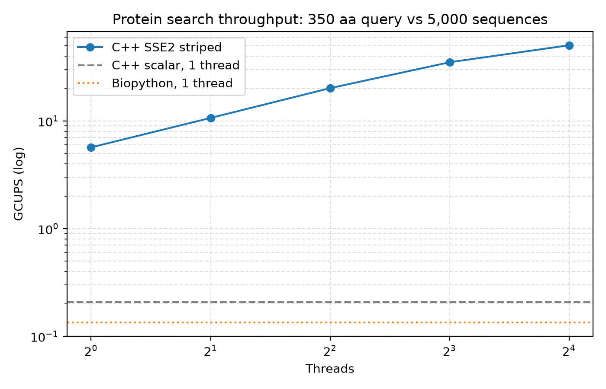
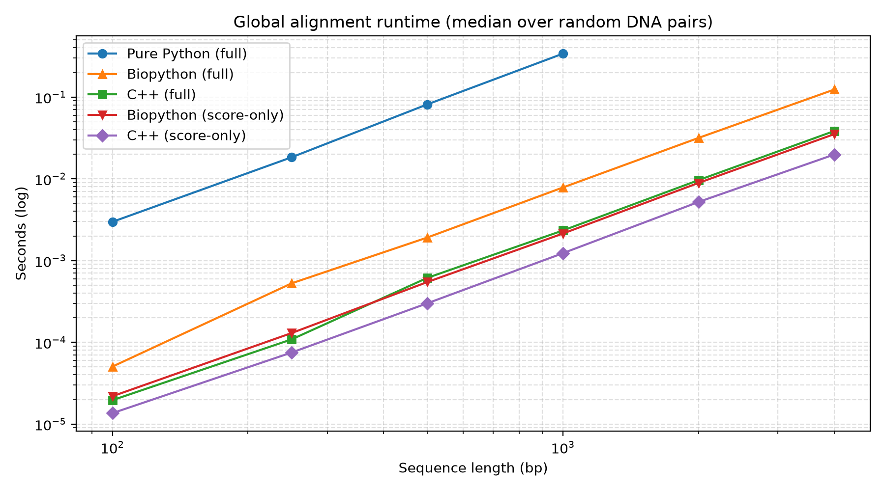

# Genomic Sequence Alignment Engine (C++ / SIMD / Python)

[](https://github.com/jaideepgorijavolu-oss/genomic-sequence-aligner/actions/workflows/ci.yml)

A pairwise alignment and protein database-search engine with a C++17 core exposed to Python through pybind11.
It implements the classic dynamic-programming aligners with full traceback, plus an **SSE2-vectorized,
multithreaded Smith-Waterman search kernel** (Farrar's striped algorithm, the approach behind SSW and parasail).

**Highlights**

- **50.4 GCUPS** protein database search on a laptop CPU (16 threads): **375× Biopython**, **27× a scalar C++ kernel** on one core
- **5 algorithms:** Needleman-Wunsch, Smith-Waterman, Gotoh (affine gaps), Hirschberg (linear space), striped SIMD local search
- **BLOSUM62 and affine gaps** (BLASTP defaults), plus match/mismatch scoring for DNA
- **Correctness verified:** 89 tests; over 7,500 randomized sequence pairs checked against Biopython and between the C++ and pure-Python backends
- **Benchmarks gated on correctness:** no speedup is reported unless the engine's scores equal Biopython's on the same inputs
- **Usable as a tool:** `seqalign` CLI for FASTA alignment and ranked database search; CI on Linux, Windows and macOS

---

## Results

### Protein database search

`python benchmark_search.py`: a 350-residue query against 5,000 synthetic proteins (1.72M residues; UniProt
amino-acid composition, lognormal lengths with median ≈ 300 aa, planted homologs), BLOSUM62 with BLASTP gap costs
(open 11, extend 1). **GCUPS** = billions of DP cell updates per second (query length × database residues / time),
the standard throughput metric for Smith-Waterman engines. AMD Ryzen 9 270 (8 cores / 16 threads), Windows, clang -O3.

| Engine | Threads | GCUPS | Speedup vs Biopython |
|:---|---:|---:|---:|
| Biopython `PairwiseAligner` (C) | 1 | 0.134 | 1.0× |
| C++ scalar kernel (int32) | 1 | 0.208 | 1.5× |
| **C++ SSE2 striped** | 1 | **5.67** | **42×** |
| C++ SSE2 striped | 2 | 10.65 | 79× |
| C++ SSE2 striped | 4 | 20.12 | 150× |
| C++ SSE2 striped | 8 | 35.02 | 261× |
| **C++ SSE2 striped** | 16 | **50.35** | **375×** |

- **Vectorization:** 27× over the scalar kernel on a single core.
- **Threading:** near-linear scaling to the 8 physical cores (6.2× at 8 threads), then a further 1.4× from SMT.
- **Search quality:** the planted homologs are the top-ranked hits.



### Pairwise global alignment (Needleman-Wunsch)

`python benchmark.py`: random DNA pairs (5 per length, median of 5 runs each). "Full" includes the traceback;
"score-only" is the linear-memory DP without traceback.

| Length (bp) | C++ vs pure Python | C++ vs Biopython (full) | C++ vs Biopython (score-only) |
|---:|---:|---:|---:|
| 100 | 152× | 2.6× | 1.6× |
| 250 | 169× | 4.8× | 1.7× |
| 500 | 132× | 3.1× | 1.8× |
| 1,000 | 146× | 3.4× | 1.7× |
| 2,000 | – | 3.3× | 1.7× |
| 4,000 | – | 3.2× | 1.8× |

Raw timings: [`benchmark_results.csv`](benchmark_results.csv) · [`search_benchmark.csv`](search_benchmark.csv).
Pure Python is only timed up to 1,000 bp (0.34 s per alignment).



---

## Algorithms

| Algorithm | Problem | Time | Memory | Output |
|:---|:---|:---|:---|:---|
| Needleman-Wunsch | Global alignment, linear gaps | O(mn) | O(mn) | Alignment + score |
| Smith-Waterman | Local alignment, linear gaps | O(mn) | O(mn) | Alignment + score |
| Gotoh | Global alignment, affine gaps (3-state DP) | O(mn) | O(mn) | Alignment + score |
| Hirschberg | Global alignment, divide and conquer | O(mn) | **O(min(m, n))** DP memory | Alignment + score |
| Striped SIMD Smith-Waterman | Local alignment, affine gaps, any substitution matrix | O(mn / 8) vector ops | O(m) | Score; batch search |

### Striped SIMD search: how it works

- **Query profile:** for every residue, the substitution scores against the whole query are precomputed into SSE2 vectors, so the inner loop does one vector load and add per step instead of 8 table lookups.
- **Striped layout (Farrar 2007):** query positions are interleaved across the 8 int16 lanes of a 128-bit register, so the lanes never depend on each other within a column. Vertical-gap dependencies that cross stripe boundaries are fixed up by the *lazy-F* loop, which usually exits after a single check.
- **Saturating 16-bit arithmetic** with an automatic exact 32-bit rescore when a score approaches the int16 limit (tested with a 35,200-point alignment).
- **Multithreading:** a `std::thread` pool with dynamic chunk scheduling (targets vary in length), with the Python GIL released for the whole search.
- **Portability:** SSE2 is baseline on every x86-64 compiler (MSVC, GCC, Clang); other CPUs such as Apple Silicon fall back to the scalar kernel automatically.

---

## Verification

| What is checked | How |
|:---|:---|
| Optimality | Scores equal Biopython's on randomized DNA and protein pairs: global, local and affine alignment under 7 scoring regimes (including large mismatch penalties, where an insertion followed by a deletion beats a substitution), and local search under 8 scoring settings including BLOSUM62, on both unrelated and mutated (homologous) pairs |
| Alignment validity | Removing gaps reproduces both input sequences, and rescoring the alignment from scratch equals the reported score |
| Backend parity | C++ and pure-Python implementations return *identical* alignments (same tie-breaking) |
| SIMD correctness | Striped kernel equals the scalar kernel across query lengths around every lane/segment boundary (1, 7, 8, 9 … 1001) |
| Overflow | Scores above 32,767 fall back to exact 32-bit results |
| Threading | Multithreaded search equals serial search, regardless of thread count |
| Linear space | Hirschberg and score-only DP equal Needleman-Wunsch scores, including highly skewed lengths |

CI builds the C++ extension and runs the full suite (with `REQUIRE_CPP=1`, so tests cannot silently fall back to
Python) on Ubuntu, Windows and macOS × Python 3.10 / 3.12.

---

## Quickstart

**Prerequisites:** Python 3.9+ and a C++17 compiler: MSVC (Visual Studio Build Tools, "Desktop development with C++") on Windows, GCC 7+ or Clang 5+ on Linux, Xcode Command Line Tools (`xcode-select --install`) on macOS. Without a compiler everything still runs on the pure-Python backend, just slower.

```bash
git clone https://github.com/jaideepgorijavolu-oss/genomic-sequence-aligner.git
cd genomic-sequence-aligner
python -m venv venv
source venv/bin/activate            # Windows: .\venv\Scripts\Activate.ps1
pip install -r requirements.txt
python setup.py build_ext --inplace  # or: pip install .  (also installs the `seqalign` command)
pytest -v
```

### Command line

```text
$ python align_cli.py ACGTTTTACG ACGACG --mode affine
# seq (10 bp) vs seq (6 bp) | mode=affine backend=cpp
# score=5 length=10 identity=60.0% mismatches=0 gaps=4 gap_opens=1

ACGTTTTACG
|||    |||
ACG----ACG

$ python align_cli.py search examples/query.fasta examples/database.fasta --matrix BLOSUM62 --top 3
# query query (22 residues) vs 4 sequences | matrix=BLOSUM62 gap_open=-11 gap_extend=-1 backend=cpp-sse2
rank   score  length  name
   1     109      22  hit_exact
   2      93      19  hit_mutated
   3       2       8  decoy_2
```

Example inputs are in [`examples/`](examples/) (`python align_cli.py examples/dna1.fasta examples/dna2.fasta --mode local`).

Modes: `global` (Needleman-Wunsch), `local` (Smith-Waterman), `affine` (Gotoh), `linear-space` (Hirschberg).

### Python API

```python
from aligner import SequenceAligner, LocalSearch, format_alignment

aligner = SequenceAligner(match_score=2, mismatch_penalty=-1, gap_penalty=-2, gap_open=-3, gap_extend=-1)
a1, a2, score = aligner.needleman_wunsch("GATTACA", "GCATGCU")   # global
a1, a2, score = aligner.smith_waterman("AAAGATTACATTT", "CCGATTACACC")  # local
a1, a2, score = aligner.gotoh("ACGTTTTACG", "ACGACG")            # affine gaps
a1, a2, score = aligner.hirschberg(long_seq_1, long_seq_2)       # linear memory
score = aligner.score(long_seq_1, long_seq_2)                    # score only, linear memory
print(format_alignment(a1, a2))

search = LocalSearch("MKTAYIAKQRQISFVKSHFSRQ", matrix="BLOSUM62", gap_open=-11, gap_extend=-1)
search.score("MKTAYIAKQRQLSFVKSHF")       # best local alignment score
search.search(database, threads=0)        # scores for every target, all cores
search.top(database, k=10)                # [(index, score), ...] best first
```

**Accepted input:** printable ASCII without whitespace or `-` (reserved for gaps in output; strip gaps from pre-aligned sequences first). Matching is case-insensitive by default. Any other symbol is an ordinary residue: with match/mismatch scoring identical symbols match (`N` matches `N`); with BLOSUM62, symbols outside its alphabet score as `X`. The CLI joins multi-line FASTA records. Full-matrix methods refuse inputs larger than
`max_cells` (default 10⁸ cells) and point to `hirschberg()` instead of exhausting memory.

---

## Project Structure

```text
genomic-sequence-aligner/
├── src/aligner_core.cpp   # C++17 kernels: NW, SW, Gotoh, Hirschberg, SSE2 striped search, thread pool
├── aligner.py             # Python API, pure-Python reference implementations, BLOSUM62
├── align_cli.py           # seqalign CLI: pairwise alignment and ranked database search
├── benchmark.py           # Pairwise benchmark vs pure Python and Biopython
├── benchmark_search.py    # GCUPS and thread-scaling benchmark for database search
├── test_aligner.py        # Pairwise algorithms: optimality, validity, parity, edge cases
├── test_search.py         # Search: Biopython agreement, SIMD vs scalar, overflow, threading
├── setup.py / pyproject.toml
└── .github/workflows/ci.yml
```

## License

MIT, see [LICENSE](LICENSE).
